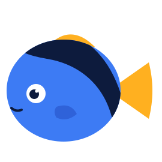
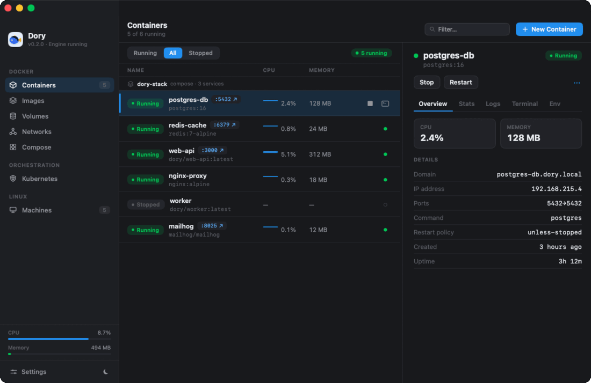

<p align="center">
  
</p>

<h1 align="center">Dory</h1>

<p align="center">
  <b>Docker &amp; Linux containers, native to your Mac.</b><br>
  A free, open-source alternative to Docker Desktop and OrbStack. One lightweight SwiftUI app
  that runs every container in a single shared VM, for a fraction of the memory.
</p>

<p align="center">
  <a href="https://github.com/Augani/dory/stargazers"></a>
  <a href="https://github.com/Augani/dory/releases/latest"></a>
  <a href="https://github.com/Augani/dory/releases"></a>
  <a href="LICENSE"></a>
  
</p>

> ⭐ **If Dory saves you memory (or money), please [star the repo](https://github.com/Augani/dory). It genuinely helps others find it.**



## Why Dory

- **One VM, all your containers.** Dory builds on [Apple's open-source container stack](https://github.com/apple/containerization)
  and boots a single persistent Linux micro-VM that runs *everything*, instead of one VM per
  container. Measured **~4.7× less idle memory** than per-container VMs (2 containers: ~122 MB vs
  ~574 MB), and the gap widens with every container you add
  ([methodology](docs/research/benchmark-methodology.md)).
- **Small and silent, permanently.** A ~6 MB native app with ~0% idle CPU. No indexers, no
  phone-home, no fans. That's a design constraint, not a version note.
- **Free for everyone, forever.** No per-seat license, no "commercial use" tier, no account,
  no sign-in. GPL-3.0, full source right here. (A [sourced comparison](docs/comparison.md) exists
  if you want one, so judge for yourself.)
- **Your `docker` CLI just works.** Dory serves the Docker API on `~/.dory/dory.sock` and
  registers a `dory` Docker context. `docker run`, `docker compose`, your existing scripts and
  tools drive it unchanged.
- **Native, not Electron.** One Swift/SwiftUI app: menu-bar agent + full dashboard, launch
  animation to launch-at-login, light and dark. No Chromium, no Node, no telemetry.

## What you get

**Docker, complete**
- Containers with live stats, logs, embedded terminal, env inspection; create / start / stop /
  restart / delete from the UI or CLI.
- Images: pull, **build** from a context folder, run, prune, **registry sign-in**, full inspect.
- Volumes (with a file browser) and networks (subnet / gateway / attached-container inspect).
- **Compose**: `up` / `down` with `.env` + variable interpolation, `depends_on` ordering, and
  `service_healthy` waiting.

**Kubernetes, one click**
- k3s inside the shared VM with selectable Kubernetes versions.
- Cluster browser: pods, deployments, services, config maps, secrets, ingresses, all with live
  health, pod exec, scale / restart / rollout controls, and `kubectl apply` from the app.
- Headless too: `dory k8s enable | disable | status` scripts the same cluster, and
  `dory k8s <kubectl args…>` runs kubectl against it. The kubeconfig is written to
  `~/.kube/dory-config` with a named `dory` context, so it sits cleanly next to your
  other clusters.
- Extensible without the GUI: `~/.dory/k8s/ports` publishes extra ports on the cluster
  container (one `HOST:CONTAINER[/proto]` per line — NodePorts become host-reachable), and
  `~/.dory/k8s/registries.yaml` is k3s' native registry mirror/trust config. Both live on the
  host, so they survive the cluster being recreated. Ports and binds are fixed when the
  container is created; changing them is reported as drift and never applied destructively —
  re-run with `--recreate` (CLI) or disable/re-enable Kubernetes (app) to apply.

**Linux machines**
- Full Ubuntu / Debian / Fedora / Alpine / Arch VMs with snapshots, terminal access, and
  use-case recipes (Node, Python, Go, Rust, …) that provision the machine ready-to-code,
  plus a composer to hand-pick runtimes, tools, and packages.
- Your home directory is shared into the engine, so `docker run -v ~/project:/app` just works.

**Networking that disappears**
- Published ports on `localhost`, automatic **`*.dory.local` domains** for every container, and
  local **HTTPS** issued by a local CA. All consent-gated, nothing installed silently.
- x86/amd64 images run on Apple silicon via emulation.

**Zero-friction start**
- First launch walks you through everything, including a one-click install of Apple's
  open-source `container` toolchain if it's missing.
- **Migration** imports your images and containers from Docker Desktop or OrbStack.

See [COMPATIBILITY.md](COMPATIBILITY.md) for the honest, per-feature status matrix.

## Install

```sh
brew install --cask Augani/dory/dory
```

…or download the notarized `.dmg` from [Releases](https://github.com/Augani/dory/releases/latest),
drag Dory to Applications, and open it. First launch guides you through the rest.

## Engine backends

Dory selects a backend automatically; `DORY_RUNTIME` overrides it. All share one
`ContainerRuntime` protocol.


| `DORY_RUNTIME` | Backend | Model |
|---|---|---|
| `shared` *(default on supported hosts)* | **Shared VM** | One persistent `dockerd`-in-VM for all containers (OrbStack-style). Standalone: no Docker required. Requires macOS 26+ on Apple silicon. |
| `apple` | **Apple `container`** | One lightweight micro-VM per container. Requires macOS 26+ on Apple silicon. |
| `docker` | **Docker Engine API** | Transparent proxy to an existing Docker-compatible socket (Docker Desktop, OrbStack, Colima, Rancher Desktop, Podman). Works on older macOS and Intel when the host engine does. |
| `mock` | **Mock** | In-memory sample data for UI development. |

## Requirements

> **This release: Dory's own engine requires Apple silicon.** The low-memory `dory-hv` engine is a
> from-scratch Apple-silicon (ARM) hypervisor, so the self-contained, memory-efficient experience is
> **Apple silicon only for now**. Native Intel support is planned for a later update — see below.

- **Apple silicon, macOS 15 (Sequoia) or later** — full experience: Dory's own bundled engine, one
  shared VM, low memory, Kubernetes, Linux machines, `*.dory.local` domains. Nothing else to install.
- **Intel Macs** — Dory runs as a native front-end (app, CLI, and `docker` context) for a
  Docker-compatible engine you install separately (Colima, Docker Desktop, Rancher Desktop, Podman,
  or OrbStack). There is **no bundled engine on Intel yet**; a native Intel engine (via
  Virtualization.framework) is on the roadmap for a later update.
- Xcode 27 or later (to build from source).

## Build & run from source

```sh
scripts/build.sh        # compile-check
scripts/test.sh         # full test suite
scripts/shot.sh         # build, launch, and screenshot the window
```

Or open `Dory.xcodeproj` in Xcode and Run.

### Optional system integration

These need a one-time admin grant (the same one OrbStack asks for) and are run by you, never
silently:

```sh
scripts/enable-networking.sh    # *.dory.local domains + trust the local CA
scripts/dory k8s enable         # bootstrap k3s in the shared VM
```

`dory k8s enable` also takes `--publish HOST:CONTAINER[/proto]` (repeatable) for extra port
publishings, `--image` to pin the k3s image, and `--recreate` to apply create-time config
drift (destroys cluster state; without it, drift is reported and the cluster is left
untouched). Once enabled:

```sh
export KUBECONFIG=~/.kube/dory-config
kubectl --context dory get pods -A
```

## Architecture

```
Dory.app (SwiftUI)
      │
      ▼
ContainerRuntime protocol ──► { Shared VM · Apple container · Docker API · Mock }
      │
      ├─ doryd shim          Docker REST API over ~/.dory/dory.sock
      ├─ Compose engine      YAML → dependency DAG → reconcile
      ├─ engine services     health state machine · event synthesis · anon-volumes
      └─ Net                 LocalCA (TLS) · DomainRouter (*.dory.local) · port forwarding
```

Everything is dependency-light: the HTTP / unix-socket transport, YAML parser, and Docker-API
client and server are hand-rolled, so the build stays small and deterministic. The
`Packages/ContainerizationEngine` package links Apple's `containerization` framework to boot the
Linux VM in-process.

## What's next

Portable dev machines you can back up and restore, remote access to your engine, and sandboxed
environments for AI agents. Follow the [releases](https://github.com/Augani/dory/releases), and
open an issue if you want to shape what comes first.

## Contributing

Contributions are welcome. See [CONTRIBUTING.md](CONTRIBUTING.md).

## License

[GPL-3.0](LICENSE) © 2026 Dory contributors.
